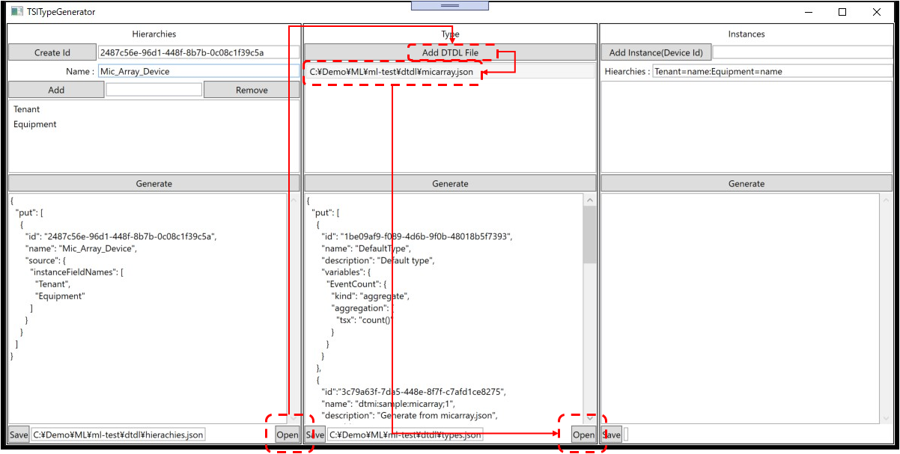

# CSV file utility tool for Azure IoT Hub
手元にあるCSVで保存されたセンサー等の時系列データを、Azure IoT Hub、Time Series Insights の仕組みを使って、クラウドで時系列データを扱うのに適した、Apache Paquet フォーマットで Blob Storage に保存するための、ユーティリティツール。  
本ツールで動作する Azure IoT Hub と接続可能なエミュレーターが、CSVファイルに記録されたデータを解釈し、Azure IoT Hub に登録されたデバイスとして、データを逐次送信する。  
とりあえず手元にCSVファイルがあって、とりあえず IoT を試してみたい方用に作ってみた。  

大抵の手元にある CSV ファイルには、”どのデバイス”のデータかというデバイス識別子的な情報は記録されていない、あるいは、等間隔で計測しているので計測時間情報も CSV ファイルの各行には保存されていないケースが十分に考えられるので、IoT Hub でデータを受信する際のデバイス識別子（deviceid）と、Cloud 側で保管する際に必要なデータレコードへのタイムスタンプ(timestamp)を追加する機能を有する。デバイス識別子、タイムスタンプが CSV ファイルの各行に存在する場合は、それを指定することも可能である。  
  
  

IoT Hub へデータを送信する際のデータフォーマットも選択可能。  
|フォーマット|説明|
|-|-|
|json|CSV の各行を、JSON形式に変換して送信|
|csv|CSV の各行を、CSV の先頭行（カラム名）を毎回先頭につけて送信|

CSV の各行を都度都度送信、複数行まとめて送信のどちらかを選択できる。CSVファイルの Azure IoT Hub への送信のボトルネックは、インターネットを介した、本ツールと Azure IoT Hub との通信であるので、複数行を一括送信したほうが時間的に早い。  
一方で、ツールを実行する PＣ のメモリ量や CPU の性能にもよると思われるので、Azure IoT Hub へのテレメトリー送信の可能最大データサイズの 256KB 以下で設定可能にしている。複数行一括送信を指定した場合は、JSONの場合は、JSON の配列形式で、 CSV の場合は、先頭行が元のCSVファイルの先頭行を1行目に、以下送信する対象の行を順次加えて送信する。  
ネットワークの転送レートが低い場合は、更に、JSON、CSVともにGZIP圧縮して送信するという機能も備えている。  

Azure IoT Hub にメッセージを送信する際、本ツールからの送信であることを示すために、"application":"csv-translator" というアプリケーションプロパティを付与して送信する。  
また、送信フォーマットを明示するために、"format"というアプリケーションプロパティも付与する。値は以下の通り  
|フォーマット|プロパティの値|
|-|-|
|json、非圧縮|json|
|json、圧縮|json-gzip|
|csv、非圧縮|csv|
|csv、圧縮|csv-gzip|

Cloud 側で Azure IoT Hub に送信されたデータの処理は送信フォーマットによって変えなければならないため、2種類以上のフォーマットを並行して使う場合は、図のように、[Azure IoT Hub にカスタムエンドポイントを付与](https://docs.microsoft.com/azure/iot-hub/iot-hub-devguide-messages-read-custom)し、適切なフィルターを設定すればよい。  
例えば、json-gzip のみを受信するカスタムエンドポイントの場合のフィルターは、  
```sql
application = 'csv-translator' AND format = 'json-gzip'
```
とすればよい。  

---

## 実行方法  
本ツールを実行するには、Azure IoT Hub が必要である。既に実験用に Azure IoT Hub インスタンスがある場合は、適切なカスタムエンドポイントを追加して、それを使ってもよい。  
ない場合は、[IoT Hub の作成](https://docs.microsoft.com/azure/iot-hub/quickstart-send-telemetry-dotnet#create-an-iot-hub)を参考に作成して、IoT Device を一つ登録する。  
IoT Device の登録が完了したら、Visual Studio で WpfAppIoTCSVTranslator を開き、登録した IoT Device の接続文字列を、[tool/WpfAppIoTCSVTranslator/WpfAppIoTCSVTranslator/appsettings.json](tool/WpfAppIoTCSVTranslator/WpfAppIoTCSVTranslator/appsettings.json) の "<- device connection string for IoT Hub ->" にコピペする。  
これでツールの設定は完了。  

### Time Series Insights の設定  
Azure IoT Hub のカスタムエンドポイントを使う場合は、[Azure Time Series Insghts 環境にイベントハブイベントソースを追加する](https://docs.microsoft.com/ja-jp/azure/time-series-insights/how-to-ingest-data-event-hub) を参考に、Time Series Insights Event Source の作成を行う。  
Azure IoT Hub に直接つなぐ場合は、[Azure Time Series Insghts 環境に IoT Hub イベントソースを追加する](https://docs.microsoft.com/ja-jp/azure/time-series-insights/how-to-ingest-data-iot-hub) を参考にする。  
次に、[Azure Time Series Insights Gen 2 環境を設定する](https://docs.microsoft.com/azure/time-series-insights/tutorial-set-up-environment)  を参考に、Time Series Insights Gen 2 環境を構築する。  
※ 以上の準備は、送信フォーマットが JSON 非圧縮の場合である。それ以外の場合は、 Stream Analytics を使って、データの解凍や、CSV→JSON変換を行うのが一番簡単なのでおすすめ。  

---
## 使い方 - CSV の各カラムの定義の生成 
### 1. CSV ファイルの選択  
  
"Select CSV File" をクリックして、送信したい CSV ファイルを選択する。  
"Load CSV Files in a Folder" チェックボックスにチェックを入れてからボタンをクリックすると、一連のデータが連続して保存されたCSVファイルを一括で送信可能。  

### 2. CSV ファイルのパースと各カラムの設定調整  
  
"Parse CSV Defnition" をクリックする。右横上のリストボックスに各カラムの値を元に推定したデータ型（Schema）等が表示される。  
特定のカラムをデバイス識別子や、タイムスタンプとして指定したい場合は、対応するチェックボックスをチェックして指示する。  
※ タイムスタンプとして指定可能なのは、ISO8601で規定された日時文字列のみ  

### 3. CSV カラムの名前の成型  
  
"TranslateColumnName" をクリックすると、CSVファイルの1行目の文字列の先頭・末尾のスペースの削除、含まれる、スペース文字を"_"に変換する。  

### 4. DTDL 生成用の定義入力  
  
IoT Hub の PnP 定義生成のための情報を付与する。  
"Model" の "@id"の"<- user definition ->"の部分を各自の用途に合わせて編集する。  
"Model" の "Display Name"を適切な値に修正する。 
その他のパートも必要に応じて修正する。  

### 5. DTDL 生成  
  
"Generate DTDL" をクリックすると、DTDLに則った形式で、PnP モデルが表示される。  
CSV ファイルの各行の送信用定義と、Device Id、タイムスタンプの定義が表示される。  

### 6. DTDL 保存  
  
"Save DTDL"をクリックして、生成されたPnPモデルを保存する。  

以上で CSV の各カラムの定義指定は完了。  

## 使い方 - CSV ファイルの送信  
前項の Step 1. で説明した方法で、CSV ファイル、もしくは CSV ファイル群が格納されているフォルダーを選択する。  
既に、PnP DTDL を生成＆保存済みの場合は、次のステップでデータを送信する。  
### 1. DTDL の選択  
  
"Select DTDL File" をクリックする。既に CSV ファイルからの PnP DTDL ファイルを生成している場合には、Alert ダイアログが表示されるので、"OK" をクリックする。  

### 2. IoT Hub への接続  
  
"Connect to IoT Hub" をクリックすると、IoT Hub にappsettings.json に設定した接続文字列で接続される。  
"Use Model Id" チェックボックスにチェックを入れてからクリックすると、PnP DTDL ファイルの modelId を伴っての接続を行う。  

### 3. 送信方法の設定  
  
送信フォーマット、送信間隔、1行/複数行、最大データサイズ、圧縮・非圧縮、タイムスタンプの時間指定 等を行う。  

### 4. タイムスタンプの設定  
  
"Data Time" にチェックを入れない場合は、本ツールがデータを送信するときのタイムスタンプが付与される。（Single Line選択時のみ利用を推奨） 
"Data Time" にチェックを入れると、"Start Time" と "Delta(msec)" が有効になり、最初のデータを送るときのタイムスタンプと、以降のデータ間隔がこの二つで指定可能である。  
CSVファイルをフォルダーで選択している場合は、継続したタイムスタンプが付与される。  
### 5. IoT Hub へのデータ送信  
"Start"　をクリックすると送信が開始される。  

## Time Series Insights の設定  
Telemetry Data が既に保存されたCSVファイルを扱う特性上、Time Series Insights へは、Event Source がメッセージ受信した時間ではなく、JSON Payload 内のタイムスタンプの時間で認識して、送られてきた Telemetry Data を扱わなければならない。  
そのための Event Source は、以下の様な手順で作成すればよい。  
※ 残念ながら現在の仕様では、入力可能なデータの日時は 現在から90日前までに限定されているらしい。  
もっと過去のデータを入力できたらいいのにね。  

Time Series Insights 作成時の Event Source 設定で、"Start time"で、"I'll choose a custom enqueued time" を選択し、送信したいCSVファイルの最も古い日時を入力する。  
また、計測時間を示すタイムスタンプの JSON 上のプロパティ名を "Timestamp" の "Property name" に入力する。  
 

既に作成済みの Time Series Insights に新たに Event Source を追加する場合は、  
  
の様に設定すればよい。  

  
この状態では、Time Series Insights Gen 2 の Model 機能を使っていないため、Tool で送信した JSON のデバイス識別子の値だけが羅列される。  

---
## Time Series Insights Gen 2 向けの Model 定義ファイルの生成  
本ツールは、Time Series Insights Gen 2 の Model 機能にアップロード可能な、hierachies.json、types.json、instances.json を生成できる。  
Time Series Insights のモデリング機能の詳細は、https://docs.microsoft.com/ja-jp/azure/time-series-insights/concepts-model-overview を参照。  
Tool 左下の "Generate TSI Model Definition" をクリックし、Generator ウィンドウを開く。  
  

### 階層（Hierachies）モデルの生成  
左側のペインで定義を行う。  
1. "Create Id" をクリックして定義する Hiearchy の Id を生成する  
1. "Name : " にわかりやすい名前を入力する 
1. 定義したい階層の名前を "Add" の右隣のテキストボックスに入力、"Add" をクリックして追加、を必要なだけ繰り返す  
1. "Generate" をクリックして、定義が記述された JSON を生成する  
1. "Save" をクリックして、"hiearchies.json" という名前で保存する  

  

図の例では、Tenant で場所を表し、その場所に Equipment として、Mic Array Device があるというモデルを表している。  

### 型（types）モデルの生成  
真ん中のペインで定義を行う。  
1. モデルとして使いたい DTDL を必要なだけ "Add DTDL File"をクリックして追加する  
1. "Generate" をクリックして、定義が記述された JSON を生成する  
1. "Save" をクリックして、"types.json" という名前で保存する。  

  

追加する DTDL ファイルは、Main Window で、CSV ファイルから生成したファイルが利用可能である。  


### インスタンスモデルの生成  
主に右側のペインで定義を行う。  
1. "Hierachies : " の右横のテキストボックスの"=name" の"name" の部分を各自の状況に合わせて変更する。一番右側の"name"は、この段階では変更しなくてよい  
1. 真ん中のペインの、追加した DTDL ファイルの中から追加する Instance で使う定義を選択する  
1. "Add Instance(Device Id)" の右側のテキストボックスに Instance 名を入力する。名前は、CSV を IoT Hub に送る際に付与した Device Id であり、かつ、その CSV から生成した DTDL ファイルが選択されている事    
1. "Generate" をクリックして、定義が記述された JSON を生成する  
1. "Save" をクリックして、"instances.json" という名前で保存する。  

  

Hiearchies のテキストボックスの文字列は、左側の階層定義により、半自動生成される。一番右側の name の部分は、"Add Instance(Device Id)" の右横のテキストボックスに文字列を入力すると連動して変更される。  

### 生成済みの、hiearchies.json、types.json を使ったインスタンスモデルの生成  
Hiearchies や Types の Id は Generate するたびに変わってしまう。既に生成済み、かつ、保存済みのファイルを再利用したい場合は、以下の手順に従って前準備を行う。  
1. 左側のペインの右下の "Open" をクリックし、生成済みの hiearchies.json を読み込む  
1. 真ん中のペインの、"Add DTDL File" をクリックして、DTDL ファイルを読み込む  
1. 読み込まれた DTDL File を選択して、右下の "Open" をクリックし、生成済みの types.json を読み込む  

  

以上の下準備で、前に説明した方法で、instances.json を生成できる。  

### 生成した hierachies.json、types.json、instances.json を Time Series Insights に登録する  
作成した Time Series Insights の Environment を開く。  
左側の Model アイコンを選択し、"Types" タブを選択して、types.json をアップロードする。  

  

次に、"Hierachies" タブを選択して、"hierachies.json" をアップロードする。  

  

次に、"Instances" タブを選択して、"instances.json" をアップロードする。  

  

以上で、ツールで生成した、型、階層、インスタンスの情報が Time Series Insights の Enviromnet に読み込まれ、既に Event Source を介して受信したテレメトリーデータで、Instance で定義されたものに該当するものがあれば、定義した階層に位置付けられて表示される。  

  

